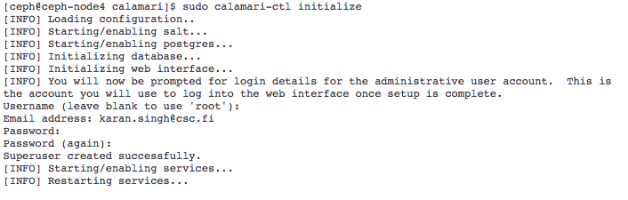
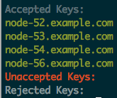

# Introduction
安裝Calamari backend與frontend於Feul Openstack上。

# Installation
首先將本資料夾放置到Openstack Controller Node上，然後進入
**Calamari_Installer**，並執行**sh calamari_install.sh**：
```
cd Calamari_Installer
sh calamari_install.sh

```
當安裝到一半時，會看到(如圖Figure.1)需要使用者輸入初始帳號與密碼資訊，輸入完後等待初始化，並完成完成安裝。


# Connect Ceph Cluster
完成後，利用**sudo salt-key -L**檢查是否有未連線叢集，利用**sudo salt-key -A**進行叢集連線：

```
sudo salt-key -L
sudo salt-key -A
```

成功後如圖Figure.2


# Test APIs and Open Dashboard
完成所有動作可以開啟[Dashboard](http://<controller_node>:8008)，或者透過[API](http://<controller_node>:8008/api/v2/)進行Ceph Management。
